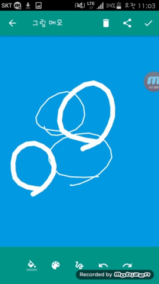

# 다꿍 다이어리 ❤️

## 1. 서비스 소개
- 손그림과 아기자기한 스티커들로 빼곡했던 아날로그 다이어리 감성은 다꿍-다이어리앱입니다.
- 여행다꿍, 맛집다꿍 등 원하는 주제로 원하는 내용을 사진, 손그림으로 꾸며낼 수 있습니다.

## 2. 차별점 
- 기존 다이어리는 너무 복잡하거나 단순해서 심심합니다.
- 심플하면서 효용성있는 디자인입니다.
 
## 3. 실제 앱 화면

| 사진 추가 | 그림 메모 추가, 공유 |
| --- | --- | 
|   |  |

## 4. 플레이스토어 링크
- 구글 플레이 스토어에 다꿍 다이어리 검색
- https://play.google.com/store/apps/details?id=com.untie.daywal&hl=ko

## 6. 개발환경
- Android
- Java
- Butterknife
- SQLite

## 7. 개발기간
- 인천대학교 SK크리애이티브앱(1) 수업시간에 한 프로젝트 입니다.
- 개발 기간 : 2016/11 ~ 2016/12

## 8. 팀원
- 기획자
  - 유예인
- 디자이너
  - 진유리
- 안드로이드 개발자
  - 이채은

